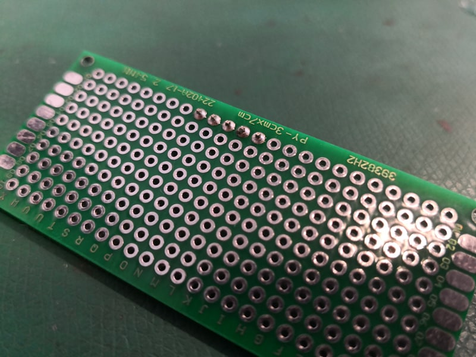
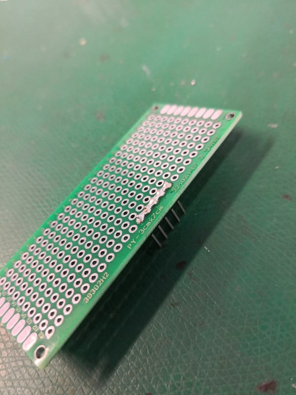
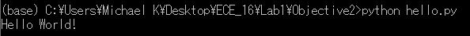
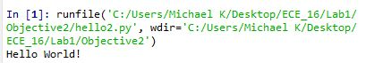
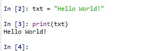

Mikhail Kardash

A12183302

# Lab 1

## Introduction

*This lab requires students to set up the environments that will be used in this course in order to familiarize students with the tools they will be using in this course.*

## Objective 1a

1. *The goal of this objective is to install required software*

2. *I installed Anaconda IDE, Git Bash, and the Arduino IDE.*

## Objective 1b

1. *The goal of this objective is to make sure students are able to solder.*

2. *I successfully performed the soldering tasks.*





## Objective 2

1. *The goal of this objective is to make sure students are able to use create and a run a Python script.*

2. *The terminal outputs the following:*



3. *Running the file results in the following:*



4. *Running line by line results in the following:*



## Objective 3

1. *The goal of this objective is to have students modify arduino C code and upload it to an arduino.*

2. *Blink.ino does the following:*

	* Designate LED as output.
	* Loop the following: 
		* Turn LED on. 
		* Wait 1 second. 
		* Turn LED off. 
		* Wait 1 second.
		
3. My modified code is as follows:

```
int counter; //counter variable
int del;
String inp;
void setup() {
	pinMode(LED_BUILTIN, OUTPUT);
	Serial.begin(9600); //begin serial
	counter = 0; //set counter to 0
	del = 1500; //default 1.5
}

void loop() {
  if (Serial.available() > 0) {
    inp = Serial.readStringUntil('\n'); //read a string until enter is hit
    if (inp == "SLOW") { //check for slow
        del = 1500;
      }
    else if (inp == "FAST") {  //check for fast
        del = 200;
    }
  }
  digitalWrite(LED_BUILTIN, HIGH);
  counter++; //increment counter
  Serial.print("Counter = "); //print counter to serial
  Serial.println(counter);   
  delay(del);     //1.5 sec delay                  
  digitalWrite(LED_BUILTIN, LOW);    
  delay(500);      //.5 sec delay                 
}
```

## Objective 4
1.  *The goal of this objective is to set up a github account and familiarize students with the assignment submission process.*

2.  *The link to the repository is* https://github.com/MKardashUCSD/ece16-sp19-MikhailKardash

## Conclusion

*This lab introduced the tools that will be used in the course. I was successfully able to install the required software, use it to achieve the objectives, and upload the results to github.*