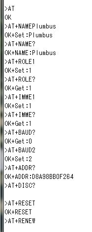
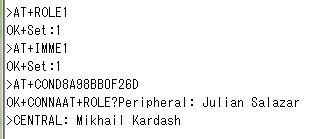
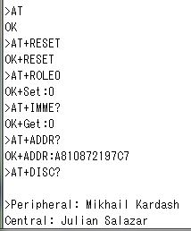
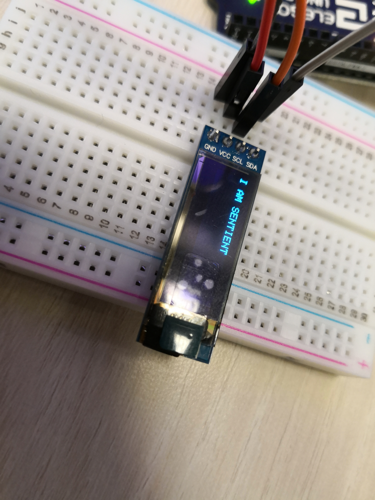
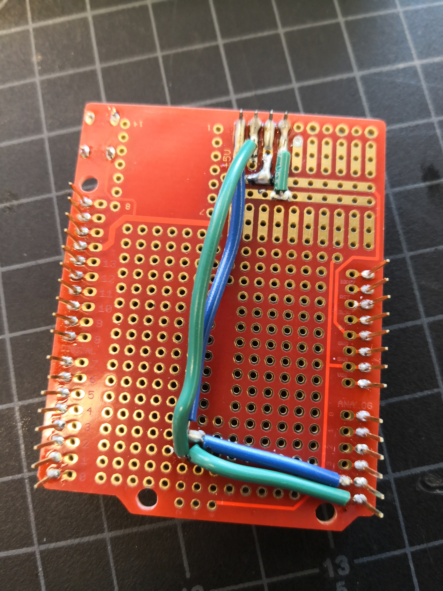

Mikhail Kardash

A12183302

# Lab 2

## Introduction

*This lab requires students to...*

## Objective 1

1. *The purpose of objective 1 is to have students successfully use the Bluetooth module. This involves implementing a circuit to connect the module to the Arduino and running the Bluetooth AT commands.*

2. *I implemented the circuit and ran the script. Below is a screenshot of the AT commands I ran.*

## Objective 2

1. *The purpose of objective 2 is to have students successfully communicate through two bluetooth modules using AT commands.*

2. *I partnered up with the student next to me. The two following screnshots show that I was able to complete this objective.*

## Objective 3

1. *The purpose of this objective is to learn how to display messages on an LED screen and to solder the screen to a protoboard.*

2. *This image shows that I was successfully able to complete objective 3a.*

3. *I was able to solder the parts onto the board, but I misplaced the screen a bit, so I had to bridge a few pins.*

## Objective 4

1. *The objective of this lab is to integrate the new LED circuit with an external breadboard circuit in order to create a stopwatch.*

2. *I was able to run the stopwatch as seen in this video: https://youtu.be/adz9muY_Jsc*

## Conclusion

*Despite some slight hiccups in objective 3, I was able to complete all of the required tasks. This lab was a good introduction to prototyping a system and was also an introductoin to Bluetooth module commands.*
