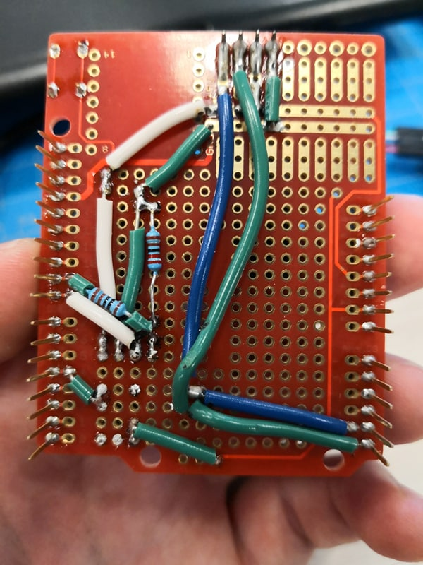

Mikhail Kardash

A12183302

# Lab 3

## Introduction

*This lab requires students to establish bluetooth communications between a laptop and the arduino via python. It also requires some soldering.*

## Objective 1

1. *The purpose of objective 1 is to have students become more familiar with python syntax and functionality through a series of tutorials.*

2. *I completed the tutorials. They were straightforward.*

## Objective 2

1. *The purpose of objective 2 is to have students set up the required python commands in order to use the Bluetooth module.*

2. *I installed the required drivers and coded my functions. The following image shows me changing my module's name via python.*

## Objective 3

1. *The purpose of this objective is to have the two modules establish a connection and communicate.*

2. *The following video shows that I completed the objective:  youtube.com/video/HJJk9ywWbpA*

## Objective 4

1. *This objective requires students to force the module to sleep via a button.*

2. *I was able to complete this objective, but the timing of the button press seems to matter. A video of this objective can be seen via the following link:  youtube.com/video/iQwSzZ-VLxc*

##Objective SOLDERING

1. *Students were also required to solder the BLE module to the board.*

2. *An image of my soldering is displayed below.*

## Conclusion

*I successfully completed this lab. Using some of the AT commands proved frustrating at times, but I sorted out all of the timing issues I had.*