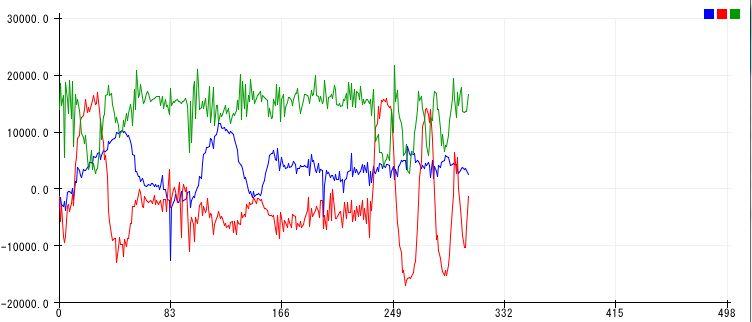
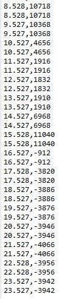

Mikhail Kardash

A12183302

# Lab 4

## Introduction

*This lab requires students to learn how to get gyroscope data and send it via bluetooth. There is also an introduction to live plotting via arduino and python as well as a tutorial about saving data to a file and reading that file.*

## Objective 1

1. *The purpose of objective 1 is to set up more reliable bluetooth communication and to set up a separate folder for libraries.*

2. *I modified the python file and set up the libraries. I will use my bluetooth library for the rest of this lab.*

## Objective 2

1. *The purpose of objective 2 is to have students read gyroscope data, plot it, and send it to their PCs via bluetooth.*

2. *The following two images show that I completed the objective. The first image shows the live plot and the second shows the data stream. Note that the sampling rate is 1 second. Note that only sprintf is required for this code and no other string manipulation.*

## Objective 3

1. *The purpose of this objective is to have the data streamed from the previous objective to be live plotted via python.*

2. *I completed this objective. The following video shows the live plotter as the gyroscope moves:  https://youtu.be/B9eem5-AF_Y*

## Objective 4

1. *This objective requires students to save read data to a csv file and then read that csv file to plot the data that it contains.*

2. *I was able to complete this objective. See the file and the image below. I coded the read_flag variable to always be the opposite of the write_flag variable.*

## Conclusion

*I successfully completed this lab. The gyroscope was relatively easy to solder and implement.*