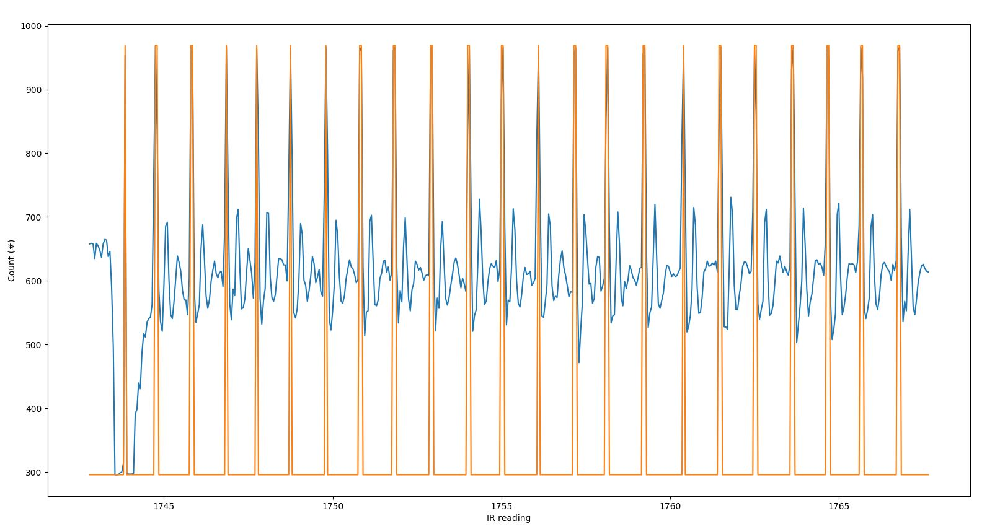

Mikhail Kardash

A12183302

# Lab 6

## Introduction

*This lab requires students to learn how to use machine learning to detect a heartbeat and calculate heart rate.*

## Objective 1

1. *The purpose of objective 1 is to set up the gaussian mixture model and classify our validation data set.*

a: *See the following output pictures. I was able to train my model and classify the data.*

Q1: *Two classes are definitely visible in the histogram. This is due to our filtering. We keep only spiky datapoints.*

## Objective 2

1. *The purpose of objective 2 is to have student consolidate the functionality of Objective 1 into a class.*

2. *I was successful in implementing the system.*

Q1. *The GMM correctly classifies the data.*

## Objective 3

1. *The purpose of this objective is to calculate heart rate based on classified data.*

2. *I completed this objective. I used numpy's diff function to detect rising edge of the heartbeat and classifed that way. No additional features required.*

## Objective Solder

1. *This objective requires students to solder IMU circuit to the breadboard*

2. *I completed the soldering and the IMU works as per this image.*

## Conclusion

*I successfully completed this lab. I created the Mixture Model and was able to convert it into a class. I did a very simple implementation of heart rate calculation.*