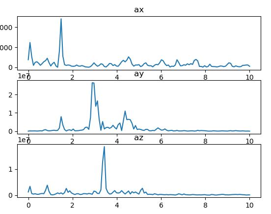
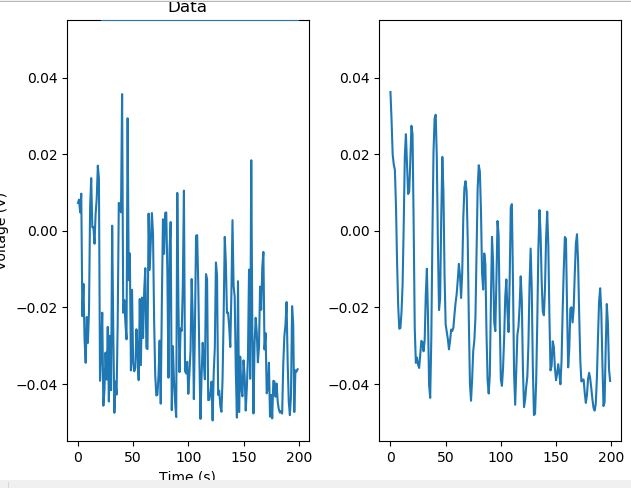

Mikhail Kardash

A12183302

# Lab 7

## Introduction

*This lab requires students to write code to live track heart rate and to use machine learning with the IMU.*

## Objective 1

1. *The purpose of objective 1 is to implement live tracking of heart rate.*

a: *See the following output video. This took many tries because the sensors are noisier than they used to be, probably due to not having stabilizing caps.*

video link: *https://www.youtube.com/watch?v=SR_X0b2BFdw*

## Objective 2

1. *The purpose of objective 2 is to repurpose our code to include IMU data.*

2. *I was successful in implementing additional functionality.*

Q1. *The most relevant axes in my opinion are the y and z axes since they have the most distinct PSD values, however since it's hard to predict which direction the arm will jerk with each step it's good to have a combination of all 3.*

Q2. *Arm movements are typically a larger disturbance in magnitude than the jerks/vibrations due to moving. But since they are more about changing the bias point, I would actually use a high pass filter to get rid of these components.*

Q3. *Each axis has it's own unique frequency components which is great for fft based feature extraction. As can be seen AX is unique. Ay and Az have similar frequency components, but AY has the widest range and may actually be the most relevant to tracking step frequency.*

Q4. *I observe clear spikes in certain frequencies in each axis. AY seems to be the most relevant to rhythmic speed.*

## Objective 3

1. *The purpose of this objective is to save idle and moving data to be trained on later.*

2. *I completed this objective. Here's what my filtered signal looks like.*

## Objective 4

1. *This objective requires students to train a KNN classifier on the data.*

2. *I completed the class and objective and my final accuracy was 78%. I did not use any additional features but I would recommend the future me to extract frequency domain features rather than using the mean max.*

## Conclusion

*I successfully completed this lab. The IR readings were incredibly noisy and caused me much frustration. I would recommend adding capacitors for the power system. Connecting everything to the same power source may have been a tactical blunder. The way forward with IMU feature extraction is unclear and I await further guidance.*