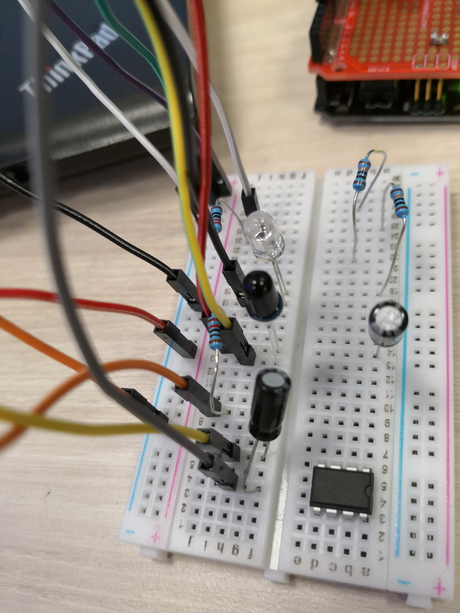
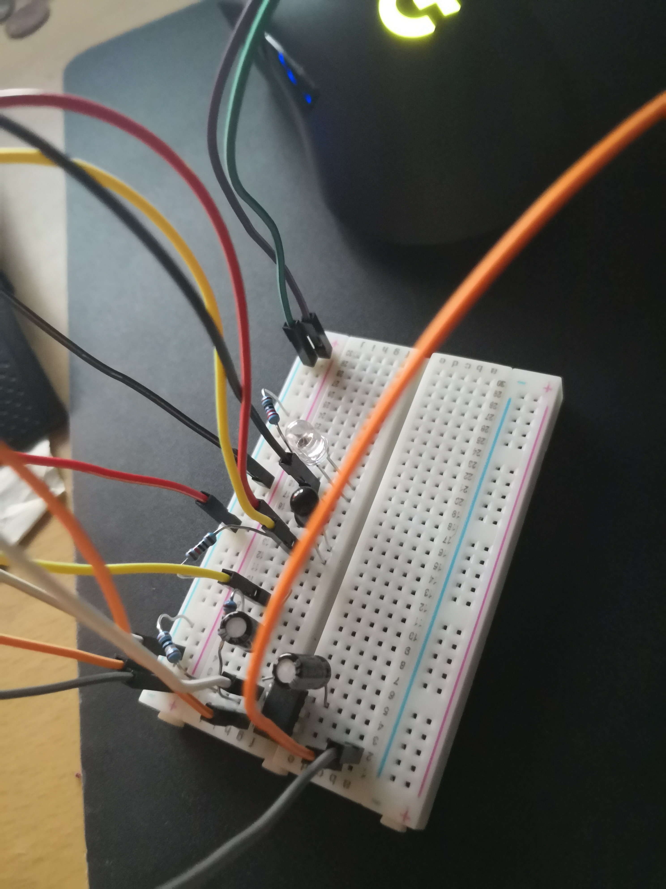
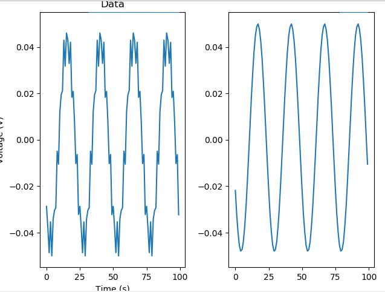
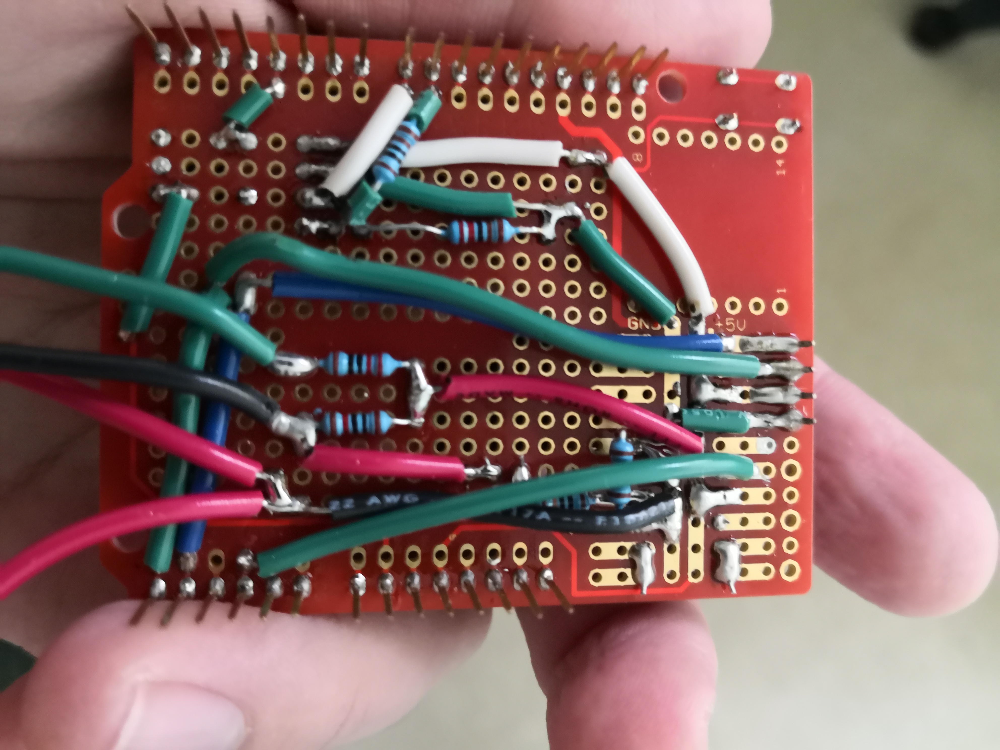

Mikhail Kardash

A12183302

# Lab 5

## Introduction

*This lab requires students to learn how to set up a heartrate monitor circuit and filter the data from it.*

## Objective 1

1. *The purpose of objective 1 is to set up more the detector-emitter circuit and read data from it.*

a: *See the following pictures of my circuit and output signal. The amplitude bias point is extremely inconsistent but otherwise the signal itself isn't so bad. I think the circuit is too sensitive to IR position in this circuit and thus can't have a consistent bias point.*

b: *See the following pictures of my circuit and output signal. The amplifier fixes the bias point and bounds the min and max amplitudes of the signal. Noise gets amplified a LOT when the circuit is not measuring a pulse.*

## Objective 2

1. *The purpose of objective 2 is to have students send heartbeat data to the python console via bluetooth and then plot that data.*

2. *I was successful in implementing the system. Data is read but it is quite choppy.*

## Objective 3

1. *The purpose of this objective is to design a filter to filter out certain frequencies of our signal.*

2. *I completed this objective. My data structure has a parameter for array length that stores past signal values, feel free to play around with this. The results of my filter are shown in the following image.*

## Objective 4

1. *This objective requires students to integrate the filter with the heartrate live plotter.*

a: *LPF-ing improves the signal so that it isn't so choppy. HPFing the signal gets rid of any biasing noise such as the finger sliding a little bit. After cascading the two filters I got a good heartrate signal. However, even without the filters my signal wasn't bad to begin with.*

2. *I was able to complete this objective. See the following youtube video:  https://youtu.be/umbUKZF906Q*

## Objective Solder

1. *This objective requires students to solder IR circuit to the breadboard*

2. *I had to align some of the resistors differently since the LED display made it hard to solder, but I completed the objective regardless.*

## Conclusion

*I successfully completed this lab. The heartrate monitor was a little hard to set up on the small breadboard but I got it to work. The most difficult part was figuring out the scipy library.*